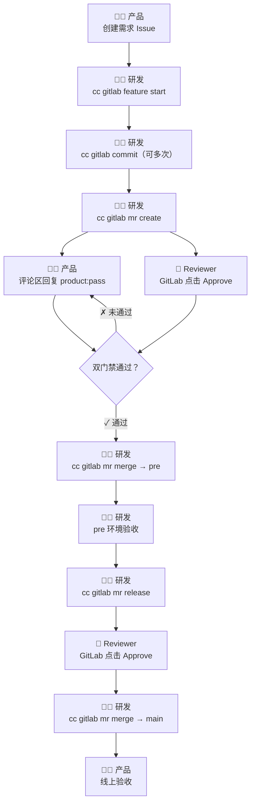
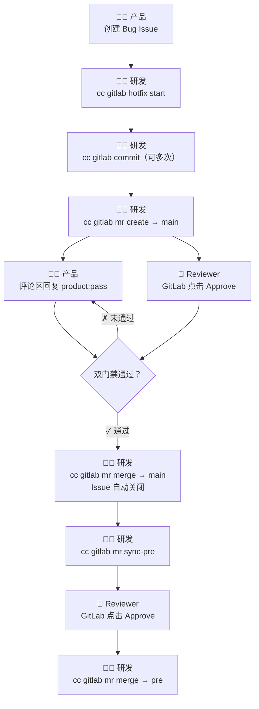

# AI-Native 产研协作流程工具

> 工具名称：`cc`（cc-gitlab）
> 适用角色：产品经理、研发、TL（技术负责人）
> 通知渠道：企业微信群机器人

---

## 一、工具简介

`cc` 是一个 AI-Native 命令行工具，将产品、研发、TL 的协作流程标准化，并在每个关键节点自动驱动下一步动作、向企业微信群发送精准通知。

**核心能力：**
- 自动校验 Issue 格式，防止信息不完整就开工
- 自动创建符合命名规范的 Git 分支
- 自动创建 MR（Merge Request）并生成标准描述
- 双门禁合并：必须同时满足产品验收 + 研发审批
- 全程企业微信 @ 对应责任人，明确下一步动作

---

## 二、安装与配置（研发必读）

### 1. 环境要求

- Python 3.8+
- Git

### 2. 安装工具

**方式一：直接从 GitHub 安装（推荐）**

```bash
pip install git+https://github.com/hustwujing/ai-workflow.git
```

**方式二：克隆后本地安装**

```bash
git clone https://github.com/hustwujing/ai-workflow.git
pip install -e ai-workflow/
```

安装完成后执行以下命令验证：

```bash
cc --help
```

### 3. 配置 .env

`cc` 命令运行时会从**当前目录向上**查找 `.env` 文件。建议将 `.env` 放在你的项目仓库根目录，这样在项目内任何位置执行命令都能自动识别。

```bash
# 在你的项目仓库根目录下
cp /path/to/ai-workflow/.env.example .env
```

`.env` 中的配置分两部分：

**团队公共配置（由 TL/管理员统一填写后共享给团队）：**

```ini
GITLAB_URL=https://gitlab.xxx.com          # GitLab 地址
GITLAB_PROJECT_ID=123                       # 项目 ID（GitLab 项目页 URL 中的数字）
GITLAB_BRANCH_MAIN=main                     # 生产分支名
GITLAB_BRANCH_PRE=pre                       # 预发/测试分支名
WECHAT_WEBHOOK_URL=https://...             # 企业微信群机器人 Webhook
WECHAT_AT_TL=138xxxx,139xxxx              # TL 手机号（多个逗号分隔）
GITLAB_REVIEWER_USERNAMES=zhangsan,lisi    # Reviewer 的 GitLab 用户名
WECHAT_USER_zhangsan=13900000001           # 全体成员手机号映射（每人一行，用于企微@）
WECHAT_USER_lisi=13900000002
WECHAT_USER_wujing03=18800000003
# ...每新增一名成员在此补充一行
```

**个人配置（每位研发自己填写）：**

```ini
GITLAB_PRIVATE_TOKEN=glpat-xxxxxxxxxxxx    # 个人 GitLab Token（见下方说明）
GITLAB_USERNAME=wujing03                   # 自己的 GitLab 用户名
```

> **注意：** `.env` 文件包含个人 Token，已加入 `.gitignore`，不会被提交到代码仓库。

### 4. 获取 GitLab Personal Access Token

1. 登录 GitLab → 右上角头像 → **Preferences**
2. 左侧菜单 → **Access Tokens**
3. 填写 Token 名称，勾选 **`api`** 权限，生成后复制
4. 将 Token 填入 `.env` 的 `GITLAB_PRIVATE_TOKEN` 字段

---

## 三、角色说明

| 角色 | 职责 |
|------|------|
| **产品经理**（Issue 提出人） | 在 GitLab 创建 Issue，在 MR 评论区回复验收口令 |
| **研发**（开发者） | 执行所有 `cc` 命令，推进代码开发和合并 |
| **TL**（技术负责人） | 在 GitLab 对 MR 完成 Approve 审批 |

---

## 四、分支结构说明

```
main（线上生产分支）
 └── pre（预发/测试分支）
      └── issue_123_xxx（需求功能分支，默认从 main checkout，合入 pre）
      └── hotfix_456_xxx（热修分支，默认从 main checkout，合入 main）
```

> 两类分支默认都从 `main` 拉取。如需从其他分支（如 `pre`、`release/xxx`）checkout，可通过 `--base` 参数指定，合入目标不受影响。

---

## 五、流程一：需求开发流程

适用场景：新功能开发、产品迭代需求



---

### 步骤 1：产品经理 — 在 GitLab 创建需求 Issue

**操作位置：** GitLab 项目 → Issues → New Issue

**要求：**

1. 标题建议以 `【需求】` 开头，例如：`【需求】用户个人中心增加消费记录入口`（约定规范，工具不强制校验标题格式）
2. 描述正文必须包含以下 4 个小节（`##` 格式标题），缺一不可：

```markdown
## 需求背景
（为什么做这个需求）

## 功能详细描述
（具体要做什么，越详细越好）

## 验收标准
（完成后如何判断功能正确，列点写清楚）

## 优先级
（高 / 中 / 低）
```

> **注意：** 如果格式不合规，研发执行命令时会直接报错退出，无法开工。需产品补充完整后研发才能继续。

**完成标志：** Issue 创建成功，获取到 Issue ID（URL 中的数字，例如 `#123`）

---

### 步骤 2：研发 — 拉取功能分支

**前提：** 已知 Issue ID

**执行命令：**

```bash
cc gitlab feature start <issue_id> [--base <分支名>]
```

示例：
```bash
# 默认从 main checkout
cc gitlab feature start 123

# 从 pre 分支 checkout（合入目标仍为 pre，不变）
cc gitlab feature start 123 --base pre
```

**工具自动完成：**
1. 从 GitLab 获取 Issue 信息
2. 校验 Issue 格式（缺少必填小节则报错退出）
3. 从基准分支（默认 `main`，可用 `--base` 指定）拉取最新代码
4. 创建并切换到新分支：`issue_123_用户个人中心增加消费记录入口`
5. 向企业微信群发送通知

**企业微信收到的消息：**

```
### 需求开发开始
> Issue #123：【需求】用户个人中心增加消费记录入口
> 需求提出人：xxx（产品）
> 开发者：wujing03
> 分支：`issue_123_用户个人中心增加消费记录入口`（基于 `main`）
> 查看 Issue（链接）

下一步 · wujing03
> 1. 当前已切换到分支，直接开始开发
> 2. 每次提交代码执行：cc gitlab commit "具体改动说明"
> 3. 开发完成后：cc gitlab mr create
```

**@ 对象：** Issue 提出人（产品）、开发者本人

---

### 步骤 3：研发 — 开发过程中提交代码

**执行命令：**

```bash
cc gitlab commit "具体改动说明"
```

示例：
```bash
cc gitlab commit "新增消费记录列表页面"
cc gitlab commit "接入消费记录接口"
```

**工具自动完成：**
- 自动在提交信息前追加 Issue 编号，实际 commit message 为：`[#123] 新增消费记录列表页面`

> 此步骤可重复执行多次，每完成一个阶段性功能即可提交。

---

### 步骤 4：研发 — 创建 MR

开发完成后执行：

```bash
cc gitlab mr create
```

**工具自动完成：**
1. 读取当前分支名，解析 Issue ID
2. 从 GitLab 获取 Issue 标题
3. 获取最近 10 条提交记录
4. 自动推送分支到远端
5. 在 GitLab 创建 MR，标题为：`[需求] #123 【需求】用户个人中心增加消费记录入口`
6. MR 合并目标：**`pre` 分支**
7. MR 描述自动填充（包含改动说明、验收指引、产品和研发的操作说明）
8. 自动将配置中的 Reviewer 设置为 MR 审阅人
9. 向企业微信群发送通知

> **MR 已存在时（补推代码）：** 如果该分支已有未合并的 MR，工具会跳过创建、直接推送代码并发送「MR 代码已更新」通知，提醒产品和 Reviewer 重新审阅。

**企业微信收到的消息（首次创建 MR）：**

```
### MR 待评审验收
> MR !45：[需求] #123 xxx
> 关联 Issue：#123
> 合并目标：pre
> 操作人：wujing03
> 查看 MR（链接）

下一步 · xxx（需求提出人/产品）
> 1. 点击上方「查看 MR」了解本次改动内容
> 2. 确认功能符合验收标准后，在评论区回复：
>    - 验收通过：product:pass
>    - 需要修改：product:reject 具体原因

下一步 · Reviewer
> 1. 打开 MR 页面审阅代码改动
> 2. 在页面右侧点击「Approve」完成审批

下一步 · wujing03（研发）
> 1. 随时查看双门禁状态：
>    cc gitlab mr check 45
> 2. 双门禁（产品验收 + 研发审批）均通过后执行合并：
>    cc gitlab mr merge 45
```

**企业微信收到的消息（MR 已存在，补推代码，且双门禁均已通过）：**

```
### MR 代码已更新
> MR !45：[需求] #123 xxx
> 合并目标：pre
> 更新人：wujing03
> 查看 MR（链接）

⚠ 注意：本次推送使以下已通过的门禁失效
> - xxx 的验收（product:pass）基于旧代码，需重新验收
> - 张三、李四 的 Approve 基于旧代码，需重新审批

下一步 · xxx（需求提出人/产品）
> 代码有新改动，请确认功能是否符合验收标准。
> 如需重新验收，在评论区回复：
>    - 验收通过：product:pass
>    - 需要修改：product:reject 具体原因

下一步 · 张三、李四
> 代码有新改动，请重新审阅并完成 Approve。
> 打开 MR 页面（链接）在右侧点击「Approve」

下一步 · wujing03（研发）
> 1. 随时查看双门禁状态：cc gitlab mr check 45
> 2. 双门禁均通过后执行合并：cc gitlab mr merge 45
```

> **说明：** 若推送前尚无产品验收或 Approve，则不会出现 `⚠ 注意` 段落，消息内容与上方相同但去掉该警告块。

**@ 对象：** Issue 提出人（产品）、TL

---

### 步骤 5：产品经理 — MR 验收

**操作位置：** 企业微信消息中点击「查看 MR」链接 → 进入 GitLab MR 页面

**操作步骤：**
1. 阅读 MR 描述中的「改动说明」，了解本次开发内容
2. 如有必要可查看「Changes」tab 了解代码层面变动
3. 在 MR 页面下方评论区（Notes）回复验收结论：
   - **通过：** 在评论框输入 `product:pass` 并提交
   - **驳回：** 在评论框输入 `product:reject 具体原因` 并提交

> **注意：**
> - `product:pass` 大小写不敏感。
> - 必须在**最近一次代码推送之后**回复才算有效；推送前的旧验收记录会被自动忽略，需重新回复。
> - 如果研发补推了新代码（`cc gitlab mr create` 提示「MR 代码已更新」），之前的 `product:pass` 自动失效，需重新验收。

---

### 步骤 6：Reviewer — 代码审批

**操作位置：** GitLab MR 页面

**操作步骤：**
1. 打开企业微信通知中的 MR 链接
2. 审阅「Changes」tab 中的代码变更
3. 在页面右侧「Reviewers」或顶部操作区点击 **「Approve」** 按钮

> - 至少需要 1 名成员完成 Approve，系统才判定审批通过。研发在双门禁均通过后执行合并命令。
> - Approval 状态直接读取 GitLab 实时数据。若项目开启了「Reset approvals on push」，推送新代码后 GitLab 会自动清除审批，Reviewer 需重新 Approve；若未开启该设置，推送后审批状态保留，`mr check` 会显示 `⚠` 提示建议重新确认。

---

### 步骤 7：研发 — 合并 MR（feature → pre）

**前提：** 产品已在评论区回复 `product:pass` && 研发已完成 Approve

**执行命令：**

```bash
cc gitlab mr merge <mr_iid>
```

示例：
```bash
cc gitlab mr merge 45
```

**工具自动完成：**
1. 检查产品验收状态（扫描 MR 评论，查找 `product:pass`）
2. 检查研发审批状态（查询 Approval 接口）
3. 如任意一项未通过，报错退出，提示对应责任人
4. 双门禁均通过后，执行 GitLab MR 合并
5. MR 合并到 `pre` 分支（此时 Issue 不关闭，功能尚未上线）
6. 向企业微信群发送通知

**企业微信收到的消息：**

```
### MR 已合并
> MR !45 已成功合并到 pre
> 操作人：wujing03
> 查看 MR（链接）

下一步 · wujing03
> 1. 登录 pre 环境，按 Issue #123 验收标准逐项验证功能
> 2. 测试通过后创建上线 MR：cc gitlab mr release
> 3. 等待 张三、李四 审批后执行合并命令上线
```

**@ 对象：** 开发者、TL

---

### 步骤 8：研发 — 在 pre 环境验收

**操作位置：** pre 测试环境

**操作步骤：**
1. 登录 pre 环境
2. 按 Issue 中「验收标准」逐项验证功能

> 如发现 Bug，直接在 pre 上修复后重新提交，无需走新的需求流程。

---

### 步骤 9：研发 — 创建上线 MR（pre → main）

pre 验收通过后执行：

```bash
cc gitlab mr release
```

**工具自动完成：**
1. 创建 MR，标题为：`[Release] 2026-05-15 pre → main`
2. MR 来源：`pre` → 目标：`main`
3. 向企业微信群发送通知，通知 TL 进行审批

**企业微信收到的消息：**

```
### pre → main 上线 MR 已创建
> MR !46 pre 测试通过，等待审批后合入 main 上线
> 操作人：wujing03
> 查看 MR（链接）

下一步 · 张三、李四
> 1. 打开 MR 页面审阅本次上线的全部变更内容
> 2. 确认无误后在页面右侧点击「Approve」完成审批

下一步 · wujing03
> 张三、李四 审批通过后，执行以下命令合并上线：
> cc gitlab mr merge 46
```

**@ 对象：** 开发者、TL

---

### 步骤 10：TL — 审批上线 MR

**操作位置：** GitLab MR 页面（点击企业微信消息中的链接）

**操作步骤：**
1. 审阅本次 pre → main 的所有变更内容
2. 点击 **「Approve」** 完成审批

---

### 步骤 11：研发 — 执行上线合并

Reviewer 审批通过后执行：

```bash
cc gitlab mr merge 46
```

**工具自动完成：**
1. 检查 TL 的 Approve 状态
2. 执行合并，`pre` → `main`
3. 扫描 `pre` 上所有已合并 MR，解析其中的 `Closes #xxx` 引用
4. **自动关闭**本次上线涉及的所有 Issue
5. 向企业微信群发送上线完成通知

**企业微信收到的消息：**

```
### pre → main 上线完成
> MR !46 已合并，以下需求随本次上线关闭：
> 操作人：wujing03
> 查看 MR（链接）

> - #123 【需求】用户个人中心增加消费记录入口（提出人：xxx）
> - #124 【需求】另一个需求（提出人：yyy）

下一步 · 各需求提出人
> 请登录线上环境，按各自 Issue 的验收标准逐项验证功能是否正常
> 如发现问题请及时提 Bug Issue（标题以【Bug】开头）
```

**@ 对象：** 所有相关需求的提出人（产品）、开发者、TL

---

### 步骤 12：产品经理 — 线上验收

**操作位置：** 线上生产环境

**操作步骤：**
1. 登录线上环境
2. 按 Issue 中「验收标准」逐项验证
3. 如发现问题，创建新的 Bug Issue（见流程二）

---

## 六、流程二：线上 Bug 热修流程

适用场景：线上紧急 Bug 修复



---

### 步骤 1：产品经理 — 在 GitLab 创建 Bug Issue

**操作位置：** GitLab 项目 → Issues → New Issue

**要求：**

1. 标题必须以 `【Bug】` 开头，例如：`【Bug】消费记录页面数据加载失败`
2. 描述正文必须包含以下 6 个小节（`##` 格式标题），缺一不可：

```markdown
## 问题现象
（看到了什么异常）

## 复现步骤
（如何复现，步骤尽量详细）

## 预期正常结果
（应该是什么效果）

## 实际异常结果
（实际看到了什么）

## 出现环境
（线上 / 哪个账号 / 哪个设备 / 什么时间）

## 严重等级
（P0 崩溃 / P1 核心功能不可用 / P2 次要功能异常 / P3 体验问题）
```

---

### 步骤 2：研发 — 拉取热修分支

```bash
cc gitlab hotfix start <issue_id> [--base <分支名>]
```

示例：
```bash
# 默认从 main checkout
cc gitlab hotfix start 456

# 从指定分支 checkout（合入目标仍为 main，不变）
cc gitlab hotfix start 456 --base release/v2.1
```

**工具自动完成：**
1. 从 GitLab 获取 Bug Issue 信息
2. 校验 Issue 格式（缺少必填小节则报错退出）
3. 从基准分支（默认 `main`，可用 `--base` 指定）拉取最新代码
4. 创建并切换到热修分支：`hotfix_456_消费记录页面数据加载失败`
5. 向企业微信群发送通知（会额外 @ TL）

**企业微信收到的消息：**

```
### 🚨 线上Bug热修开始
> Issue #456：【Bug】消费记录页面数据加载失败
> 问题提出人：xxx
> 开发者：wujing03
> 分支：`hotfix_456_消费记录页面数据加载失败`（基于 `main`）
> 查看 Issue（链接）

下一步 · wujing03
> 1. 当前已切换到分支，直接开始修复
> 2. 修复完成后提交代码：cc gitlab commit "修复说明"
> 3. 推送分支并创建 MR（直接合入 main）：cc gitlab mr create
```

**@ 对象：** Issue 提出人、开发者、**TL（热修必须通知 TL）**

---

### 步骤 3：研发 — 修复并提交

```bash
cc gitlab commit "修复消费记录接口超时问题"
```

---

### 步骤 4：研发 — 创建 MR（直接合入 main）

```bash
cc gitlab mr create
```

**与需求 MR 的区别：**
- MR 目标分支是 **`main`**（热修不经过 pre，直接上线）
- MR 标题前缀为 `[Bug热修]`

**企业微信通知内容**与需求流程步骤 4 格式相同，但合并目标显示为 `main`。

---

### 步骤 5：产品验收 + Reviewer 审批

与需求流程步骤 5、6 相同：
- **产品：** 在 MR 评论区回复 `product:pass`
- **Reviewer：** 在 GitLab MR 页面点击「Approve」

---

### 步骤 6：研发 — 合并热修 MR

```bash
cc gitlab mr merge <mr_iid>
```

**工具自动完成：**
1. 检查双门禁（`product:pass` + Approve）
2. 合并到 `main`
3. **自动关闭**对应 Bug Issue
4. 向企业微信群发送通知

**企业微信收到的消息：**

```
### MR 已合并
> MR !47 已成功合并到 main
> 关联 Issue：#456（已自动关闭）
> 操作人：wujing03
> 查看 MR（链接）

下一步 · wujing03
> 1. 确认线上 Issue #456 问题已修复
> 2. 将热修代码同步到 pre 保持环境对齐：
>    cc gitlab mr sync-pre
```

**@ 对象：** 开发者、TL

---

### 步骤 7：研发 — 同步热修代码到 pre

```bash
cc gitlab mr sync-pre
```

**工具自动完成：**
1. 创建 MR：`main` → `pre`，标题为 `[SyncPre] 2026-05-15 main → pre`
2. 向企业微信群发送通知，告知 TL 审批同步 MR

**企业微信收到的消息：**

```
### main → pre 同步 MR 已创建
> MR !48 热修代码待同步到 pre
> 操作人：wujing03
> 查看 MR（链接）

下一步 · 张三、李四
> 1. 打开 MR 页面确认热修内容与 main 一致
> 2. 在页面右侧点击「Approve」完成审批

下一步 · wujing03
> 张三、李四 审批通过后，执行以下命令完成同步：
> cc gitlab mr merge 48
```

---

### 步骤 8：TL 审批 + 研发执行同步合并

TL 在 GitLab 点击「Approve」后：

```bash
cc gitlab mr merge 48
```

---

## 七、辅助命令

### 检查 MR 双门禁状态（不执行合并）

当不确定 MR 是否满足合并条件时，可先查询：

```bash
cc gitlab mr check <mr_iid>
```

**示例输出（双门禁通过，可合并）：**
```
=== MR !45 双门禁状态 ===
  产品验收（product:pass）：✓ 通过
  研发 Approval 审批：      ✓ 通过

[结论] 满足合并条件，可执行 cc gitlab mr merge。
```

**示例输出（产品未验收）：**
```
=== MR !45 双门禁状态 ===
  产品验收（product:pass）：✗ 未通过
  研发 Approval 审批：      ✓ 通过

[结论] 尚不满足合并条件，请等待相应审批。
```

**示例输出（产品验收后研发又补推了代码）：**
```
=== MR !45 双门禁状态 ===
  产品验收（product:pass）：✗ 未通过（最近推送后需重新在评论区回复 product:pass）
  研发 Approval 审批：      ✓ 通过

[结论] 尚不满足合并条件，请等待相应审批。
```

**示例输出（Approve 后又补推代码且项目未开启自动重置）：**
```
=== MR !45 双门禁状态 ===
  产品验收（product:pass）：✓ 通过
  研发 Approval 审批：      ✓ 通过  ⚠ 审批后有新提交，建议 Reviewer 重新审阅

[结论] 门禁已通过，但审批后有新提交，建议 Reviewer 确认后再执行合并。
```

> **说明：**
> - `product:pass` 必须在最近一次代码推送**之后**回复才有效，之前的旧记录工具会自动忽略。
> - Approval 状态直接读取 GitLab 实时数据。若项目开启了「Reset approvals on push」，GitLab 推代码后会自动清除审批，工具直接判为未通过；若未开启，工具会显示 `⚠` 提示建议 Reviewer 重新确认。

---

## 八、完整命令速查

| 命令 | 适用阶段 | 执行人 |
|------|----------|--------|
| `cc gitlab feature start <issue_id> [--base 分支]` | 需求开发开始，默认从 main checkout | 研发 |
| `cc gitlab hotfix start <issue_id> [--base 分支]` | Bug 热修开始，默认从 main checkout | 研发 |
| `cc gitlab commit "说明"` | 开发过程中提交代码 | 研发 |
| `cc gitlab mr create` | 开发完成，创建 MR | 研发 |
| `cc gitlab mr check <mr_iid>` | 查看 MR 双门禁状态 | 研发 |
| `cc gitlab mr merge <mr_iid>` | 执行合并（需双门禁通过） | 研发 |
| `cc gitlab mr release` | pre 验收通过，创建上线 MR | 研发 |
| `cc gitlab mr sync-pre` | 热修后同步 main 到 pre | 研发 |

---

## 九、Issue 格式模板

### 需求 Issue 模板

```
标题：【需求】xxx（建议格式，非强制）

## 需求背景


## 功能详细描述


## 验收标准


## 优先级

```

### Bug Issue 模板

```
标题：【Bug】xxx

## 问题现象


## 复现步骤


## 预期正常结果


## 实际异常结果


## 出现环境


## 严重等级

```

---

## 十、常见问题

**Q：执行 `feature start` / `hotfix start` 报错「Issue格式不合规」怎么办？**

A：需产品在 GitLab Issue 中补充缺少的小节（如「## 验收标准」），补充完成后研发重新执行命令即可。

**Q：执行 `feature start` / `hotfix start` 报错「Issue 不存在或无权访问」怎么办？**

A：检查 Issue ID 是否正确，或确认当前账号是否有该 GitLab 项目的访问权限。

**Q：执行 `feature start` / `hotfix start` 报错「GitLab Token 无效或权限不足」怎么办？**

A：检查 `.env` 中的 `GITLAB_PRIVATE_TOKEN` 是否填写正确，Token 需具备 `api` 权限。

**Q：执行 `feature start` / `hotfix start` 报错「存在未提交的本地改动」怎么办？**

A：有未提交代码导致无法切换分支，执行以下命令暂存后重试：
```bash
git stash
cc gitlab feature start <issue_id>   # 完成后执行 git stash pop 恢复
```

**Q：执行 `feature start` / `hotfix start` 报错「本地分支已存在」怎么办？**

A：之前已创建过该分支，两种选择：
```bash
# 直接切换到已有分支继续开发
git checkout <分支名>

# 或删除旧分支重新创建
git branch -D <分支名>
cc gitlab feature start <issue_id>
```

**Q：执行 `mr create` 报错「推送被拒绝」（non-fast-forward）怎么办？**

A：远端分支比本地多了新提交，需先同步再推送：
```bash
git pull --rebase origin <当前分支名>
cc gitlab mr create
```

**Q：执行 `mr create` 提示「分支已有 MR，本次推送已更新其代码」是什么意思？**

A：该分支已存在未合并的 MR，本次新提交已自动推送到远端并更新了该 MR 的代码。工具会输出已有 MR 的页面链接，并自动向企业微信群发送「MR 代码已更新」通知，提醒产品和 Reviewer 重新审阅。

如果推送前已有产品验收或研发 Approve，企微通知中还会附带 **⚠ 注意** 警告，明确指出哪一方的操作基于旧代码、需要重新进行。无需任何额外操作，等待双门禁重新通过后执行合并即可。

**Q：执行任意命令报错「当前处于 rebase 冲突状态」怎么办？**

A：`git pull --rebase` 遇到冲突后会暂停，需手动解决后继续：
```bash
git status                    # 查看冲突文件
# 手动编辑冲突文件，解决所有冲突标记
git add <冲突文件>
git rebase --continue         # 继续 rebase
# 如需放弃 rebase 回到操作前状态：
git rebase --abort
```
rebase 完成后重新执行原命令即可。

**Q：执行 `mr merge` 报错「产品验收未通过」怎么办？**

A：产品还未在 MR 评论区回复 `product:pass`。错误信息中会附上 MR 评论区直链，发给产品直接操作即可。

**Q：执行 `mr merge` 报错「研发 Approval 审批未通过」怎么办？**

A：错误信息中会指出具体的 Reviewer 姓名和 MR 页面链接，请联系对应 Reviewer 在 GitLab MR 页面点击「Approve」后再重新执行。

**Q：执行 `mr merge` 报错「分支无法合并」（406）怎么办？**

A：打开错误信息中的 MR 页面链接，常见原因：
1. 存在合并冲突 — 在本地解决冲突后重新推送
2. CI 流水线未通过 — 等待或修复后重试
3. 分支落后目标分支 — 先执行 `git rebase` 同步最新代码

**Q：企业微信没有收到通知？**

A：可能是 `WECHAT_WEBHOOK_URL` 未配置，或该用户的手机号未在 `.env` 中配置 `WECHAT_USER_xxx` 映射。

**Q：`cc gitlab commit` 和直接 `git commit` 有什么区别？**

A：`cc gitlab commit` 会自动在 commit message 前追加 `[#issue_id]`，方便后续 MR 关联 Issue；其他逻辑完全一致。
