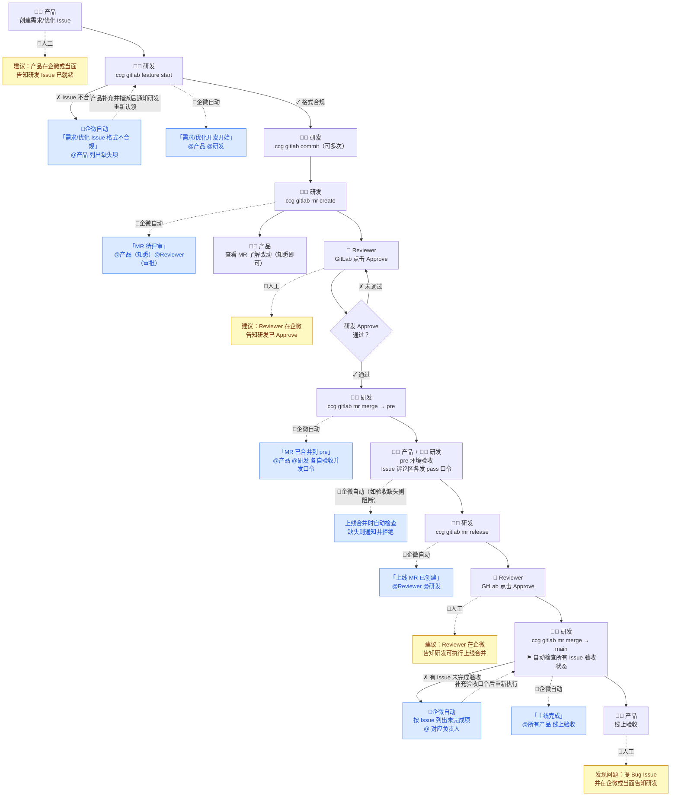
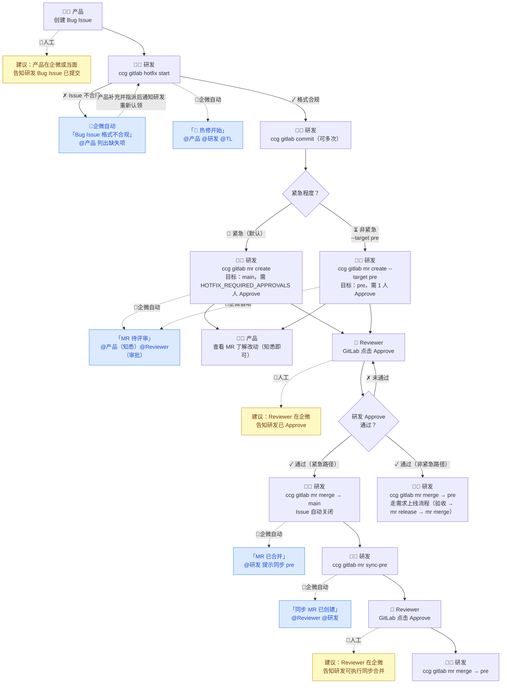

# AI-Native 产研协作流程工具

> 工具名称：`ccg`（cc-gitlab）
> 适用角色：产品经理、研发、Reviewer（TL）
> 通知渠道：企业微信群机器人

---

## 一、工具简介

`ccg` 是一个 AI-Native 命令行工具，将产品、研发、TL 的协作流程标准化，并在每个关键节点自动驱动下一步动作、向企业微信群发送精准通知。

**核心能力：**
- 自动校验 Issue 格式，防止信息不完整就开工；支持三种类型：需求（feature）、优化（improve）、Bug，通过模板章节自动识别，无需依赖标题前缀；**缺少必填章节或未指派研发（assignee）均视为不合规**，自动通知产品补充
- 自动创建符合命名规范的 Git 分支
- 自动创建 MR（Merge Request）并生成标准描述
- MR 合并前强制研发 Approve 审批
- pre 环境验收双确认：产品和研发分别在 Issue 评论区发布验收口令（`product:pass` / `developer:pass`），缺一不可才允许上线；支持 `product:reject` / `developer:reject 原因` 显式拒绝并附带说明
- 全程企业微信 @ 对应责任人，明确下一步动作
- 可选配套 [ai-gitlab-hook](https://github.com/hustwujing/-ai-gitlab-hook)：将所有人工通知节点升级为 GitLab 事件自动触发，流程完全闭环

---

## 二、安装与配置（研发必读）

### 1. 环境要求

- Python 3.8+
- Git

### 2. 安装工具

**方式一：直接从 GitHub 安装（推荐）**

```bash
pip install git+https://github.com/hustwujing/ai-workflow.git
```

**方式二：克隆后本地安装**

```bash
git clone https://github.com/hustwujing/ai-workflow.git
pip install -e ai-workflow/
```

安装完成后执行以下命令验证：

```bash
ccg --help
```

### 3. 配置环境变量

`ccg` 命令运行时会从**当前目录向上**查找配置文件，建议放在项目仓库根目录。配置分两个文件：

| 文件 | 用途 | 是否提交 git |
|------|------|-------------|
| `.env` | 团队公共配置，由 TL/管理员维护 | ✅ 提交 |
| `.env.local` | 个人私有配置，每人自己填写 | ❌ 不提交（已 gitignore） |

**第一步：将本仓库的 `.env` 复制到你的项目仓库根目录，填写团队配置（TL 操作一次，共享给全团队）：**

```ini
GITLAB_URL=https://gitlab.xxx.com          # GitLab 地址
GITLAB_PROJECT_ID=123                       # 项目 ID（GitLab 项目页 URL 中的数字）
GITLAB_BRANCH_MAIN=main                     # 生产分支名
GITLAB_BRANCH_PRE=pre                       # 预发/测试分支名
WECHAT_WEBHOOK_URL=https://...             # 研发工作流通知群 Webhook（MR 创建/合并/更新等）
WECHAT_DAILY_REPORT_WEBHOOK_URL=https://... # 日报专用群 Webhook（建议单独建群@老板，不填则复用上方）
GITLAB_HOOK_URL=http://your-server:8888   # 可选：ai-gitlab-hook 地址，配置后日报含违规记录
WECHAT_AT_TL=138xxxx,139xxxx              # Reviewer 手机号（多个逗号分隔）
GITLAB_REVIEWER_USERNAMES=zhangsan,lisi    # Reviewer GitLab 用户名
WECHAT_USER_zhangsan=13900000001           # 全体成员手机号映射（新成员入职时追加）
WECHAT_USER_lisi=13900000002
HOTFIX_REQUIRED_APPROVALS=2               # 热修 MR 所需 Approve 人数（默认 2，需求 MR 固定为 1）
```

**第二步：在项目仓库根目录创建 `.env.local`，填写个人配置（每位研发自己操作）：**

```bash
cp .env.local.example .env.local   # 或手动创建
```

```ini
GITLAB_PRIVATE_TOKEN=glpat-xxxxxxxxxxxx    # 个人 GitLab Token（见下方说明）
GITLAB_USERNAME=XXXXXX                   # 自己的 GitLab 用户名
```

### 4. 获取 GitLab Personal Access Token

1. 登录 GitLab → 右上角头像 → **Preferences**
2. 左侧菜单 → **Access Tokens**
3. 填写 Token 名称，勾选 **`api`** 权限，生成后复制
4. 将 Token 填入 `.env` 的 `GITLAB_PRIVATE_TOKEN` 字段

### 5. 配套 GitLab Webhook 自动通知（可选，强烈推荐）

流程图中黄色框 👤 的节点默认需要人工在企微通知下一位责任人。部署 **[ai-gitlab-hook](https://github.com/hustwujing/-ai-gitlab-hook)** 服务后，这些节点全部由 GitLab 事件自动触发，无需人工提醒，流程完全闭环。

**自动化覆盖范围：**

| 场景 | 原来 | 配套后 |
|------|------|--------|
| 需求/优化/Bug Issue 创建（格式合规） | 产品人工告知研发认领 | GitLab 事件自动 @ 研发 |
| Issue 格式不合规 | 研发跑命令时通知产品 | Issue 创建时立即通知产品 |
| Issue 格式补全 | 产品补充后人工告知研发 | GitLab 事件自动 @ 研发 |
| 需求/热修 MR Approve | Reviewer 人工告知研发可合并 | GitLab 事件自动 @ 研发 |
| 上线 MR Approve | TL 人工告知研发可执行上线 | GitLab 事件自动 @ 研发 |
| pre 验收 pass / reject | 研发/产品各自人工通知对方 | 评论后自动互通知对方 |

**部署步骤：**

1. 按 [ai-gitlab-hook README](https://github.com/hustwujing/-ai-gitlab-hook) 完成服务部署（约 5 分钟）
2. 在 GitLab 项目中注册 Webhook：**Settings → Webhooks → Add new webhook**
   - **URL**：`http(s)://your-server/gitlab/webhook`
   - **勾选事件**：`Issues events`、`Merge request events`、`Comments`
   - **Secret token**（可选）：与服务端 `config.yaml` 中的 `secret_token` 保持一致
3. 保存后即生效，后续所有黄色节点由 GitLab 自动推送，无需人工提醒

---

## 三、角色说明

| 角色 | 职责 |
|------|------|
| **产品经理**（Issue 提出人/reporter） | 在 GitLab 创建 Issue；在 pre 环境验收后于 Issue 评论区发布 `product:pass` |
| **研发**（开发者/assignee） | 执行所有 `ccg` 命令，推进代码开发和合并；在 pre 环境验收后于 Issue 评论区发布 `developer:pass` |
| **Reviewer**（代码审批人，通常为 TL） | 在 GitLab MR 页面点击 Approve 完成代码审批 |

---

## 四、分支结构说明

```
main（线上生产分支）
 └── pre（预发/测试分支）
      └── issue_123_xxx（需求功能分支，默认从 main checkout，合入 pre）
      └── hotfix_456_xxx（热修分支，默认从 main checkout，合入 main；非紧急时可 --target pre 随需求上线）
```

> 两类分支默认都从 `main` 拉取。如需从其他分支（如 `pre`、`release/xxx`）checkout，可通过 `--base` 参数指定。hotfix 合入目标默认为 `main`，可通过 `--target` 覆盖。

---

## 五、流程一：需求开发流程

适用场景：新功能开发、产品迭代需求

> 蓝色框 🤖 = 企微机器人自动发送；黄色框 👤 = 默认需人工在企微告知（部署 [ai-gitlab-hook](https://github.com/hustwujing/-ai-gitlab-hook) 后可自动化）



---

### 步骤 1：产品经理 — 在 GitLab 创建需求 / 优化 Issue

**操作位置：** GitLab 项目 → Issues → New Issue

工具支持两种类型，按实际情况选择模板填写：

**类型一：需求（feature）** — 新功能开发

描述正文必须包含以下小节（`##` 格式标题）：

```markdown
## 需求背景

## 功能详细描述

## 交互/页面说明（可附图）

## 验收标准（必填）
1. 
2. 

## 优先级：低/中/高
```

**类型二：优化（improve）** — 体验优化 / 性能改进

描述正文必须包含以下小节：

```markdown
## 优化背景

## 现状问题

## 优化方案

## 预期收益

## 优先级：低/中/高
```

> **工具如何识别类型：** 通过 description 中的章节头自动判断，无需在标题中加前缀。`需求背景` → 需求，`优化背景` → 优化。

> **注意：** 如果格式不合规（缺少必填章节，或未通过 GitLab 指派研发 assignee），研发执行 `feature start` 时会直接报错退出，同时工具会**自动向企业微信群发送通知并 @ 产品**，消息中列明缺失项，产品补充并指派后通知研发重新认领即可。

**完成标志：** Issue 创建成功，获取到 Issue ID（URL 中的数字，例如 `#123`）

> **下一步（产品）：** Issue 就绪后，在企业微信或当面告知对应研发（附上 Issue 链接）。

---

### 步骤 2：研发 — 拉取功能分支

**前提：** 已知 Issue ID

**执行命令：**

```bash
ccg gitlab feature start <issue_id> [--base <分支名>]
```

示例：
```bash
# 默认从 main checkout
ccg gitlab feature start 123

# 从 pre 分支 checkout（合入目标仍为 pre，不变）
ccg gitlab feature start 123 --base pre
```

**工具自动完成：**
1. 从 GitLab 获取 Issue 信息
2. 自动识别 Issue 类型（需求 / 优化），按对应模板校验格式（类型不符或格式不合规则报错退出，并自动向企微群 @ 产品告知详情）
3. 从基准分支（默认 `main`，可用 `--base` 指定）拉取最新代码
4. 创建并切换到新分支：`issue_123_用户个人中心增加消费记录入口`
5. 向企业微信群发送通知

**企业微信收到的消息（Issue 格式不合规时）：**

```
### 需求 Issue 格式不合规        # 优化 Issue 时显示「优化 Issue 格式不合规」
> Issue #123：用户个人中心增加消费记录入口
> 需求提出人：xxx（产品）
> 认领研发：wujing03
> 查看 Issue（链接）

不合规详情
> 缺少必填小节：验收标准（必填）、优先级

下一步 · xxx（需求提出人）
> 请按标准模板补充以上小节内容：Issue #123（链接）
> 完成后通知研发重新认领
```

**@ 对象（格式不合规时）：** Issue 提出人（产品）

**企业微信收到的消息（格式合规，正常开始开发）：**

```
### 需求开发开始
> Issue #123：【需求】用户个人中心增加消费记录入口
> 需求提出人：xxx（产品）
> 开发者：wujing03
> 分支：`issue_123_用户个人中心增加消费记录入口`（基于 `main`）
> 查看 Issue（链接）

下一步 · wujing03
> 1. 当前已切换到分支，直接开始开发
> 2. 每次提交代码执行：ccg gitlab commit（可省略说明，自动生成）
> 3. 开发完成后：ccg gitlab mr create
```

**@ 对象：** Issue 提出人（产品）、开发者本人

---

### 步骤 3：研发 — 开发过程中提交代码

**执行命令：**

```bash
# 方式一：省略说明，自动生成（推荐）
ccg gitlab commit

# 方式二：直接传入说明
ccg gitlab commit "具体改动说明"
```

**省略说明时的交互流程：**
1. 工具读取暂存区（`git diff --cached`）内容
2. 若配置了 `LLM_API_KEY`，调用大模型生成一行中文说明并预填到编辑器
3. 若未配置 LLM，打开编辑器并将变更文件摘要以 `#` 注释形式展示供参考
4. 编辑器保存后使用最终内容提交；`#` 开头的注释行自动忽略；内容为空则取消

**工具自动完成：**
- 自动在提交信息前追加 Issue 编号，实际 commit message 为：`[#123] 新增消费记录列表页面`

> 此步骤可重复执行多次，每完成一个阶段性功能即可提交。

---

### 步骤 4：研发 — 创建 MR

开发完成后执行：

```bash
ccg gitlab mr create
```

**工具自动完成：**
1. 读取当前分支名，解析 Issue ID
2. 从 GitLab 获取 Issue 标题
3. 获取最近 10 条提交记录
4. 自动推送分支到远端
5. 在 GitLab 创建 MR，标题为：`[需求] #123 【需求】用户个人中心增加消费记录入口`
6. MR 合并目标：**`pre` 分支**
7. MR 描述自动填充（包含改动说明、知悉指引、研发操作说明）
8. 自动将配置中的 Reviewer 设置为 MR 审阅人
9. 向企业微信群发送通知

> **MR 已存在时（补推代码）：** 如果该分支已有未合并的 MR，工具会跳过创建、直接推送代码。若本次推送包含新提交，会发送「MR 代码已更新」通知，提醒产品和 Reviewer 重新查看；若代码无变更，则仅打印提示，不发送企微通知。

**企业微信收到的消息（首次创建 MR）：**

```
### MR 待评审
> MR !45：[需求] #123 xxx
> 关联 Issue：#123
> 合并目标：pre
> 操作人：wujing03
> 查看 MR（链接）

下一步 · xxx（需求提出人）
> 点击上方「查看 MR」了解本次改动内容（知悉即可，无需操作）

下一步 · Reviewer
> 1. 打开 MR 页面审阅代码改动
> 2. 在页面右侧点击「Approve」完成审批

下一步 · wujing03（研发）
> 1. 随时查看审批状态：
>    ccg gitlab mr check 45
> 2. 研发 Approve 通过后执行合并：
>    ccg gitlab mr merge 45
```

**企业微信收到的消息（MR 已存在，补推代码，且 Reviewer 已 Approve）：**

```
### MR 代码已更新
> MR !45：[需求] #123 xxx
> 合并目标：pre
> 更新人：wujing03
> 查看 MR（链接）

⚠ 注意：本次推送使以下已通过的门禁失效
> - 张三、李四 的 Approve 基于旧代码，需重新审批

下一步 · xxx（需求提出人）
> 代码有新改动，请查看改动内容（知悉即可，无需操作）

下一步 · 张三、李四
> 代码有新改动，请重新审阅并完成 Approve。
> 打开 MR 页面（链接）在右侧点击「Approve」

下一步 · wujing03（研发）
> 1. 随时查看审批状态：ccg gitlab mr check 45
> 2. 研发 Approve 通过后执行合并：ccg gitlab mr merge 45
```

**@ 对象：** Issue 提出人（产品）、TL

---

### 步骤 5：产品经理 — MR 知悉

**操作位置：** 企微通知中的 MR 链接

**操作步骤：**
1. 点击链接打开 MR 页面，阅读「改动说明」了解本次开发内容

> 此步骤**纯知悉，无需任何操作**，不阻断合并，研发无需等待。真正的功能验收在步骤 8（pre 环境）进行。

---

### 步骤 6：Reviewer — 代码审批

**操作位置：** GitLab MR 页面

**操作步骤：**
1. 打开企业微信通知中的 MR 链接
2. 审阅「Changes」tab 中的代码变更
3. 在页面右侧「Reviewers」或顶部操作区点击 **「Approve」** 按钮

> - 至少需要 1 名成员完成 Approve，系统才判定审批通过。
> - 若项目开启了「Reset approvals on push」，推送新代码后 GitLab 会自动清除审批，Reviewer 需重新 Approve；若未开启，`mr check` 会显示 `⚠` 提示建议重新确认。

---

### 步骤 7：研发 — 合并 MR（feature → pre）

**前提：** Reviewer 已完成 GitLab Approve

**执行命令：**

```bash
ccg gitlab mr merge <mr_iid>
```

示例：
```bash
ccg gitlab mr merge 45
```

**工具自动完成：**
1. 检查研发审批状态（查询 Approval 接口）
2. 审批未通过则报错退出，提示联系 Reviewer
3. 执行 GitLab MR 合并到 `pre` 分支（此时 Issue 不关闭，功能尚未上线）
4. 向企业微信群发送通知，通知产品和研发前往 pre 验收

**企业微信收到的消息：**

```
### MR 已合并
> MR !45 已成功合并到 pre
> 关联 Issue：#123
> 操作人：wujing03
> 查看 MR（链接）

下一步 · xxx（产品）
> 1. 登录 pre 环境，按 Issue #123 验收标准逐项验证功能
> 2. 验收通过后，在 Issue 评论区回复：product:pass

下一步 · wujing03（研发）
> 1. 登录 pre 环境，按 Issue #123 验收标准逐项验证功能
> 2. 验收通过后，在 Issue 评论区回复：developer:pass
```

**@ 对象：** 产品（Issue reporter）、研发（开发者）、TL

---

### 步骤 8：产品 + 研发 — 在 pre 环境验收

**操作位置：** pre 测试环境 + GitLab Issue 评论区

**产品操作步骤：**
1. 登录 pre 环境
2. 按 Issue 中「验收标准」逐项验证功能
3. 验收通过：在 **GitLab Issue 评论区**回复 `product:pass`
4. 验收不通过：在 **GitLab Issue 评论区**回复 `product:reject 原因说明`（原因说明会同步到企微阻断通知）

**研发操作步骤：**
1. 登录 pre 环境
2. 按 Issue 中「验收标准」逐项验证功能
3. 验收通过：在 **GitLab Issue 评论区**回复 `developer:pass`
4. 验收不通过：在 **GitLab Issue 评论区**回复 `developer:reject 原因说明`

> **注意：**
> - 口令发在 **Issue 评论区**，不是 MR 评论区。
> - 均需在该 Issue 关联的 MR **最后一次合入 pre** 之后发布才有效；之前的旧记录会被忽略。
> - **最新评论时序胜出**：reject 晚于 pass 则视为拒绝，pass 晚于 reject 则视为通过。
> - 支持全角冒号（`：`）等价于半角冒号（`:`）。
> - 如果发现 Bug，直接在 pre 上修复后重新提交，重新合入 pre 后需重新发布验收口令。
> - 如果一个需求有多名研发，任意一人发布 `developer:pass` 即可；但非 Issue assignee 代发时，上线合并时企微会出现警示。
> - 产品由 Issue reporter 发布为正常；其他产品代发时，企微同样会出现警示。

---

### 步骤 9：研发 — 创建上线 MR（pre → main）

产品和研发均完成 pre 验收后执行：

```bash
ccg gitlab mr release
```

**工具自动完成：**
1. 创建 MR，标题为：`[Release] 2026-05-15 pre → main`
2. MR 来源：`pre` → 目标：`main`
3. 向企业微信群发送通知，通知 TL 进行审批

**企业微信收到的消息：**

```
### pre → main 上线 MR 已创建
> MR !46 pre 测试通过，等待审批后合入 main 上线
> 操作人：wujing03
> 查看 MR（链接）

下一步 · 张三、李四
> 1. 打开 MR 页面审阅本次上线的全部变更内容
> 2. 确认无误后在页面右侧点击「Approve」完成审批

下一步 · wujing03
> 张三、李四 审批通过后，执行以下命令合并上线：
> ccg gitlab mr merge 46
```

**@ 对象：** 开发者、TL

---

### 步骤 10：TL — 审批上线 MR

**操作位置：** GitLab MR 页面（点击企业微信消息中的链接）

**操作步骤：**
1. 审阅本次 pre → main 的所有变更内容
2. 点击 **「Approve」** 完成审批

---

### 步骤 11：研发 — 执行上线合并

Reviewer 审批通过后执行：

```bash
ccg gitlab mr merge 46
```

**工具自动完成：**
1. 检查 TL 的 Approve 状态
2. **检查本次上线涉及的所有 Issue 是否完成 pre 验收**（见下方说明）
3. 验收检查通过后，执行合并 `pre` → `main`
4. 扫描 `pre` 上所有已合并 MR，解析其中的 `Closes #xxx` 引用
5. **自动关闭**本次上线涉及的所有 Issue
6. 向企业微信群发送上线完成通知

**Step 9 验收检查逻辑：**
- 找出所有通过 `Closes #xxx` 关联到 pre MR 的、**当前仍为 opened 状态**的 Issue
- 对每个 Issue，以其关联 MR **最后一次合入 pre 的时间**为基准
- 检查该 Issue 评论区在基准时间之后 `product:pass` / `product:reject` 和 `developer:pass` / `developer:reject` 的最新评论
- 最新评论时序胜出：pass 晚于 reject → 通过；reject 晚于 pass → 拒绝（附带原因）；无记录 → 未验收
- 任意 Issue 存在未通过项（rejected 或 pending）→ 拒绝合并，向企微发送阻断通知

**企业微信收到的消息（验收未完成，阻断上线）：**

```
### pre → main 上线被阻止
> MR !46 合入主干失败，以下 Issue 未完成 pre 环境验收
> 操作人：wujing03
> 查看 MR（链接）

**Issue #123**：【需求】用户个人中心增加消费记录入口（查看）
> 产品验收（product:pass）：✗ 已拒绝：页面在 iPhone SE 下布局错乱  负责人：xxx
> 研发验收（developer:pass）：✓ 已通过

**Issue #124**：【需求】另一个需求（查看）
> 产品验收（product:pass）：✓ 已通过
> 研发验收（developer:pass）：✗ 未验收  负责人：yyy

请以上负责人登录 pre 环境完成验收，在对应 Issue 评论区发布口令后重试
> 产品验收通过：product:pass
> 产品验收拒绝：product:reject 原因说明
> 研发验收通过：developer:pass
> 研发验收拒绝：developer:reject 原因说明
```

**企业微信收到的消息（验收通过，上线完成）：**

```
### pre → main 上线完成
> MR !46 已合并，以下需求随本次上线关闭：
> 操作人：wujing03
> 查看 MR（链接）

> - #123 【需求】用户个人中心增加消费记录入口（提出人：xxx）
> - #124 【需求】另一个需求（提出人：yyy）

下一步 · 各需求提出人
> 请登录线上环境，按各自 Issue 的验收标准逐项验证功能是否正常
> 如发现问题请及时提 Bug Issue（使用 Bug 模板，见流程二）
```

**@ 对象：** 验收未完成时只 @ 对应 Issue 的责任人；上线完成时 @ 所有相关需求的提出人（产品）、开发者、TL

---

### 步骤 12：产品经理 — 线上验收

**操作位置：** 线上生产环境

**操作步骤：**
1. 登录线上环境
2. 按 Issue 中「验收标准」逐项验证
3. 如发现问题，创建新的 Bug Issue（见流程二）

---

## 六、流程二：线上 Bug 热修流程

适用场景：线上紧急 Bug 修复

> 蓝色框 🤖 = 企微机器人自动发送；黄色框 👤 = 默认需人工在企微告知（部署 [ai-gitlab-hook](https://github.com/hustwujing/-ai-gitlab-hook) 后可自动化）



---

### 步骤 1：产品经理 — 在 GitLab 创建 Bug Issue

**操作位置：** GitLab 项目 → Issues → New Issue

**要求：**

描述正文必须包含以下 6 个小节（`##` 格式标题），缺一不可：

```markdown
## 问题现象

## 复现步骤
1. 
2. 

## 预期正常结果

## 实际异常结果

## 出现环境：线上/pre/测试

## 严重等级：轻微/一般/阻塞
```

> **工具如何识别类型：** 通过 `问题现象` 章节头自动判断为 Bug，无需在标题中加前缀。

> **注意：** 6 个章节必须齐全，同时需通过 GitLab **指派负责研发（assignee）**，否则研发执行 `hotfix start` 时会报错退出并 @ 产品补充。

> **下一步（产品）：** Bug Issue 创建后，立即在企业微信或当面告知对应研发，并附上 Issue 链接。线上 Bug 紧急，请同时通知 TL。

---

### 步骤 2：研发 — 拉取热修分支

```bash
ccg gitlab hotfix start <issue_id> [--base <分支名>]
```

示例：
```bash
# 默认从 main checkout
ccg gitlab hotfix start 456

# 从指定分支 checkout（--base 不影响合入目标，目标在 mr create 时决定）
ccg gitlab hotfix start 456 --base release/v2.1
```

**工具自动完成：**
1. 从 GitLab 获取 Bug Issue 信息
2. 校验 Issue 格式（缺少必填小节则报错退出，并自动向企微群 @ Bug 提出人告知不合规详情）
3. 从基准分支（默认 `main`，可用 `--base` 指定）拉取最新代码
4. 创建并切换到热修分支：`hotfix_456_消费记录页面数据加载失败`
5. 向企业微信群发送通知（会额外 @ TL）

**@ 对象（格式不合规时）：** Issue 提出人（产品）

**@ 对象（正常开始热修）：** Issue 提出人、开发者、**TL（热修必须通知 TL）**

---

### 步骤 3：研发 — 修复并提交

```bash
ccg gitlab commit "修复消费记录接口超时问题"
```

---

### 步骤 4：研发 — 创建 MR

```bash
# 紧急路径：直接合入 main 上线（默认）
ccg gitlab mr create

# 非紧急路径：合入 pre，随下次正常发布一起上线
ccg gitlab mr create --target pre
```

**说明：**
- **默认（紧急路径）**：目标分支为 `main`，热修直接上线，需要 `HOTFIX_REQUIRED_APPROVALS`（默认 2）人 Approve。
- **`--target pre`（非紧急路径）**：目标分支为 `pre`，与下次上线一起发布，只需 1 人 Approve，等同于普通需求 MR。
- MR 标题前缀为 `[Bug热修]`。

企业微信通知内容与需求流程步骤 4 格式相同，但合并目标显示为 `main` 或 `pre`。

---

### 步骤 5：产品知悉 + Reviewer 审批

- **产品：** 打开 MR 链接了解改动内容（知悉即可，无需操作）
- **Reviewer：** 在 GitLab MR 页面点击「Approve」

> **注意：** Approve 人数取决于目标分支——合入 `main`（默认紧急路径）需要至少 `HOTFIX_REQUIRED_APPROVALS`（默认 2）名；合入 `pre`（`--target pre` 非紧急路径）只需 1 名，与需求 MR 相同。企微通知中会明确标注所需人数。

---

### 步骤 6：研发 — 合并热修 MR

```bash
ccg gitlab mr merge <mr_iid>
```

**工具自动完成：**
1. 检查研发 Approve 状态（人数要求见步骤 5）
2. 合并到目标分支
3. 向企业微信群发送通知

**路径一：合入 `main`（紧急路径，默认）**

- **自动关闭**对应 Bug Issue
- 通知研发将热修代码同步到 pre（执行步骤 7）

```
### MR 已合并
> MR !47 已成功合并到 main
> 关联 Issue：#456（已自动关闭）
> 操作人：wujing03
> 查看 MR（链接）

下一步 · wujing03
> 1. 确认线上 Issue #456 问题已修复
> 2. 将热修代码同步到 pre 保持环境对齐：
>    ccg gitlab mr sync-pre
```

**路径二：合入 `pre`（非紧急路径，`--target pre`）**

- Issue **不关闭**，等待随下次 `mr release` 统一上线时关闭
- 通知产品和研发前往 pre 验收（后续流程与需求上线相同：`mr release` → `mr merge`）
- 无需执行 sync-pre（已在 pre 中）

**@ 对象：** 开发者、TL

---

### 步骤 7：研发 — 同步热修代码到 pre

```bash
ccg gitlab mr sync-pre
```

**工具自动完成：**
1. 创建 MR：`main` → `pre`，标题为 `[SyncPre] 2026-05-15 main → pre`
2. 向企业微信群发送通知，告知 TL 审批同步 MR

---

### 步骤 8：TL 审批 + 研发执行同步合并

TL 在 GitLab 点击「Approve」后：

```bash
ccg gitlab mr merge 48
```

---

## 七、辅助命令

### 检查 MR 审批状态（不执行合并）

当不确定 MR 是否满足合并条件时，可先查询：

```bash
ccg gitlab mr check <mr_iid>
```

**示例输出（需求 MR，审批通过）：**
```
=== MR !45 门禁状态 ===
  研发 Approval 审批：✓ 通过（1/1）

[结论] 满足合并条件，可执行 ccg gitlab mr merge。
```

**示例输出（热修 MR，仅 1 人 Approve，不足 2 人）：**
```
=== MR !47 门禁状态 ===
  研发 Approval 审批：✗ 未通过（1/2）

[结论] 尚不满足合并条件，请等待研发 Approve 审批。
```

**示例输出（Approve 后又补推代码且项目未开启自动重置）：**
```
=== MR !45 门禁状态 ===
  研发 Approval 审批：✓ 通过（1/1）  ⚠ 审批后有新提交，建议 Reviewer 重新审阅

[结论] 门禁已通过，但审批后有新提交，建议 Reviewer 确认后再执行合并。
```

> Approval 状态直接读取 GitLab 实时数据。若项目开启了「Reset approvals on push」，推代码后 GitLab 会自动清除审批；若未开启，工具会显示 `⚠` 提示建议 Reviewer 重新确认。

---

## 八、每日工作日报

`ccg gitlab daily-report` 会从 GitLab 采集过去 N 小时的数据，经 LLM 整理后发送至企业微信，让老板随时掌握团队进展。

**统计维度：**
- 需求动态：新提出/已完成/进行中（含提出人/执行人，Issue 标题为可点击链接）
- Bug 动态：新提出/已修复/修复中（独立板块，与需求分开展示）
- 代码贡献：总提交次数、总行数变化，以及每人的提交量和关联需求；同一人不同 git 名字通过邮箱查询 GitLab 账号自动归并
- 流程违规：按人头统计违规次数，次数多的排前面

### 使用方法

```bash
# 完整流程：采集数据 → LLM 总结 → 发企微（需配置 LLM_API_KEY）
ccg gitlab daily-report

# 统计过去 48 小时
ccg gitlab daily-report --hours 48

# 跳过 LLM，使用内置格式化直接发送
ccg gitlab daily-report --no-llm

# 预览日报内容（不发送企微）；使用 LLM 时会打印调用状态和返回字符数
ccg gitlab daily-report --dry-run
```

`--dry-run` 控制台输出示例（配置了 LLM）：

```
[daily-report] 统计过去 24 小时（2026-05-14T10:34:04Z 至今）...
[daily-report] 拉取新 Issues...
...
[daily-report] 调用 LLM（deepseek-v4-pro）生成总结...
[daily-report] LLM 调用成功，返回 423 字符。

============================================================
### 📊 团队日报（过去24小时）
...
============================================================

[daily-report] --dry-run 模式，不发送企微通知。
```

> LLM 调用失败时会打印 `LLM 调用失败 HTTP xxx: ...` 并自动降级为内置格式化。

### LLM 配置（可选）

在项目 `.env` 中新增以下配置，支持任何 OpenAI-compatible 接口：

```ini
LLM_BASE_URL=https://api.openai.com/v1   # 默认值，可替换为其他兼容接口
LLM_API_KEY=sk-xxx                        # 必填才会启用 LLM
LLM_MODEL=gpt-4o-mini                    # 默认值
```

> 不配置 `LLM_API_KEY` 时，工具自动降级为内置格式化，无需任何外部依赖。

### 流程违规记录（可选，需配套 ai-gitlab-hook）

配置 `GITLAB_HOOK_URL` 后，日报会自动追加时间窗口内的违规记录，包含操作人、违规时间、违规动作、违背原则：

```ini
GITLAB_HOOK_URL=http://your-server:8000   # 只填 host:port，路径由工具自动拼接
```

示例输出：
```
⚠ 流程违规记录
> - **张三**：3 次
> - **李四**：1 次
```

> 不配置此项时日报正常生成，只是不包含违规板块。

### 日报发送群配置

日报默认发送到 `WECHAT_WEBHOOK_URL` 指定的群（研发工作流通知群）。建议单独建一个群拉老板进来，配置独立 Webhook：

```ini
# 在 .env 中添加（不填则复用 WECHAT_WEBHOOK_URL）
WECHAT_DAILY_REPORT_WEBHOOK_URL=https://qyapi.weixin.qq.com/cgi-bin/webhook/send?key=yyy
```

### 配合定时任务自动发送

在服务器上配置 cron，每天 18:00 自动执行：

```bash
# crontab -e
0 18 * * * cd /path/to/project && ccg gitlab daily-report
```

---

## 九、完整命令速查

| 命令 | 适用阶段 | 执行人 |
|------|----------|--------|
| `ccg gitlab feature start <issue_id> [--base 分支]` | 需求/优化开发开始，自动识别 Issue 类型，默认从 main checkout | 研发 |
| `ccg gitlab hotfix start <issue_id> [--base 分支]` | Bug 热修开始，默认从 main checkout | 研发 |
| `ccg gitlab commit ["说明"]` | 开发过程中提交代码；省略说明时自动调用 LLM 生成并打开编辑器确认 | 研发 |
| `ccg gitlab mr create [--target 分支]` | 开发完成，创建 MR；hotfix 默认合 `main`，可用 `--target pre` 走非紧急路径 | 研发 |
| `ccg gitlab mr check <mr_iid>` | 查看 MR 研发审批状态 | 研发 |
| `ccg gitlab mr merge <mr_iid>` | 执行合并（需研发 Approve 通过） | 研发 |
| `ccg gitlab mr release` | 创建上线 MR（pre → main） | 研发 |
| `ccg gitlab mr sync-pre` | 热修后同步 main 到 pre | 研发 |
| `ccg gitlab daily-report [--hours N] [--no-llm] [--dry-run]` | 生成并发送每日工作日报 | TL / 管理员 |

---

## 十、Issue 格式模板

### 需求 Issue 模板

```
## 需求背景


## 功能详细描述


## 交互/页面说明（可附图）


## 验收标准（必填）
1. 
2. 

## 优先级：低/中/高
```

### 优化 Issue 模板

```
## 优化背景


## 现状问题


## 优化方案


## 预期收益


## 优先级：低/中/高
```

### Bug Issue 模板

```
## 问题现象


## 复现步骤
1. 
2. 

## 预期正常结果


## 实际异常结果


## 出现环境：线上/pre/测试

## 严重等级：轻微/一般/阻塞
```

---

## 十一、常见问题

**Q：执行 `feature start` / `hotfix start` 报错「Issue格式不合规」怎么办？**

A：工具会报错退出并**自动向企业微信群发送通知 @ 产品**，消息中列明缺少哪些项（可能是缺失章节，也可能是未指派 assignee）及 Issue 直链。产品在 GitLab Issue 中补充完整并指派研发后通知研发重新执行命令即可。

**Q：执行 `feature start` / `hotfix start` 报错「Issue 不存在或无权访问」怎么办？**

A：检查 Issue ID 是否正确，或确认当前账号是否有该 GitLab 项目的访问权限。

**Q：执行 `feature start` / `hotfix start` 报错「GitLab Token 无效或权限不足」怎么办？**

A：检查 `.env` 中的 `GITLAB_PRIVATE_TOKEN` 是否填写正确，Token 需具备 `api` 权限。

**Q：执行 `feature start` / `hotfix start` 报错「存在未提交的本地改动」怎么办？**

A：有未提交代码导致无法切换分支，执行以下命令暂存后重试：
```bash
git stash
ccg gitlab feature start <issue_id>   # 完成后执行 git stash pop 恢复
```

**Q：执行 `feature start` / `hotfix start` 报错「本地分支已存在」怎么办？**

A：之前已创建过该分支，两种选择：
```bash
# 直接切换到已有分支继续开发
git checkout <分支名>

# 或删除旧分支重新创建
git branch -D <分支名>
ccg gitlab feature start <issue_id>
```

**Q：执行 `mr create` 报错「推送被拒绝」（non-fast-forward）怎么办？**

A：远端分支比本地多了新提交，需先同步再推送：
```bash
git pull --rebase origin <当前分支名>
ccg gitlab mr create
```

**Q：执行 `mr create` 提示「分支已有 MR，本次推送已更新其代码」是什么意思？**

A：该分支已存在未合并的 MR，本次新提交已自动推送并更新了该 MR 的代码。工具会自动向企业微信群发送「MR 代码已更新」通知，提醒产品和 Reviewer 重新查看。如果 Reviewer 已 Approve，企微通知中还会附带 **⚠ 注意** 警告，说明需要重新 Approve。

**Q：执行 `mr merge` 报错「研发 Approval 审批未通过」怎么办？**

A：错误信息中会指出具体的 Reviewer 姓名和 MR 页面链接，请联系对应 Reviewer 在 GitLab MR 页面点击「Approve」后再重新执行。

**Q：执行 `mr merge`（上线合并）报错「pre 环境验收未完成」怎么办？**

A：企微群会收到阻断通知，按 Issue 列出哪些是产品未 pass、哪些是研发未 pass，并 @ 对应负责人。相关人员登录 pre 环境完成验收后，在 **GitLab Issue 评论区**（不是 MR 评论区）发布对应口令（`product:pass` 或 `developer:pass`），再重新执行 `ccg gitlab mr merge <mr_iid>` 即可。

**Q：product:pass / developer:pass 发在哪里？**

A：发在 **GitLab Issue 评论区**，不是 MR 评论区。进入对应 Issue 页面，在下方评论框输入口令并提交即可。

**Q：验收发现问题，如何明确拒绝并说明原因？**

A：在 **GitLab Issue 评论区**回复 `product:reject 原因说明` 或 `developer:reject 原因说明`（冒号后跟原因）。工具在下次上线合并时会在企微阻断通知中展示该原因，方便研发快速定位问题。修复重新合入 pre 后，需重新发布 `pass` 口令（最新评论时序胜出，pass 晚于 reject 则视为通过）。

**Q：执行 `mr merge` 报错「MR 当前不可合并」（405）怎么办？**

A：GitLab 返回 405 表示 MR 存在阻止合并的条件，错误信息会列出具体原因，常见情况：
1. **Draft/WIP 状态** — 在 GitLab MR 页面点击「Mark as ready」解除草稿状态
2. **Pipeline 未通过** — 等待 CI 跑完或修复失败的 job 后重试
3. **存在未解决的讨论** — 在 MR 页面逐一 resolve 讨论后重试
4. **存在合并冲突** — 在本地解决冲突后重新推送

**Q：执行 `mr merge` 报错「分支无法合并」（406）怎么办？**

A：打开错误信息中的 MR 页面链接，常见原因：
1. 存在合并冲突 — 在本地解决冲突后重新推送
2. CI 流水线未通过 — 等待或修复后重试
3. 分支落后目标分支 — 先执行 `git rebase` 同步最新代码

**Q：企业微信没有收到通知？**

A：可能是 `WECHAT_WEBHOOK_URL` 未配置，或该用户的手机号未在 `.env` 中配置 `WECHAT_USER_xxx` 映射。

**Q：`ccg gitlab commit` 和直接 `git commit` 有什么区别？**

A：两点区别：① 自动在 commit message 前追加 `[#issue_id]`，方便后续 MR 关联 Issue；② 省略说明时会调用 LLM 根据暂存区 diff 自动生成提交说明，并打开编辑器供确认修改（未配置 `LLM_API_KEY` 时直接打开编辑器，并将变更摘要以注释形式展示）。
